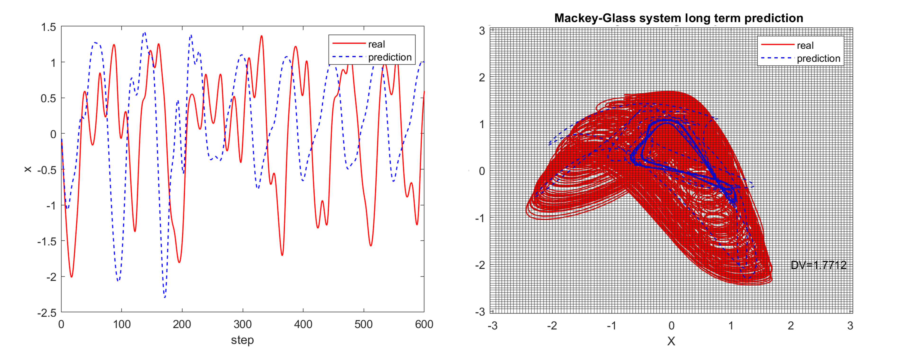

<h1 align="center">Reservoir Computing and Hyperparameter Optimization</h1>

<p align="center">

</p>

<h3>Reservoir Computing</h3>

Reservoir computing (RC) is a type of recurrent neural networks (RNNs). A reservoir computer is composed of three layers: an input layer, a hidden recurrent layer, and an output layer. The distinguishing feature of RC is that only the readout weights ($W_{out}$) are trained using a linear regression, while the input weigths ($W_{in}$) and recurrent connection weights within the reservoir ($\mathcal{A}$) are determined before training. This approach gives RC a notable advantage over other RNNs, particularly in terms of rapid learning.

Now suppose we have the training data: input $u$ and the corresponding output $v$, we first update the reservoir states $r$. Activated by the sequence of input signals $[u(1), u(2), \cdots, u(t)]$, the hidden layer state is updated step by step at the input signal time interval according to 

$$r(t+1) = (1-\alpha) \cdot r(t) + \alpha \cdot \tanh[\mathcal{A} \cdot r(t) + W_{in} \cdot u(t)],$$
where $\alpha$ is the leakage parameter and the activation function is the hyperbolic tangent function. Note that $\mathcal{A}$ is the adjacent matrix of size $n \times n$, which determines the link relationship of the reservoir network, while $r$ is a vector of size $n \times 1$, which represents the state of each node in the reservoir network. In addition, reservoir network $\mathcal{A}$ and input matrix $W_{in}$ are randomly generated before training by Gaussian distribution and uniform distribution, respectively.

We calculate, update, and concatenate the vector $r(t)$ characterizing the dynamical state of the reservoir network into a matrix $\mathcal{R}$. The output signal is concatenated into a matrix $V$. Then the output matrix is determined by using Tikhonov regularization as 

$$W_{out} = V \cdot R'^T (R' \cdot R'^T + \beta I)^{-1},$$

where $I$ is the identity matrix, $\beta$ is the regularization coefficient, and $R'$ is the transport of $R$.

Once we finish the training as previously described, we can **continue** to get the input in the testing phase and update the reservoir state $r(t)$, calculate the output (prediction) step by step by

$$V(t) = W_{out}\cdot r(t).$$

There are various hyperparameters to be optimized (I will introduce the hyperparameters optimization later), for example, the spectral radius $\rho$ and the link probability $p$ to determine the reservoir network, the scaling factor of the input weights of the input matrix $\gamma$, the leakage parameter $\alpha$, the regularization coefficient $\beta$, and the noise level $\sigma$ injected to the training data.

Reservoir computing is a powerful tool that can be used to solve a wide variety of problems, such as time series prediction, trajectories tracking control, inverse modeling, speech and signal processing, and more. For a deeper insights, you are invited to explore [my homepage](https://zmzhai.com/). Additionally, the field is witnessing growing interest in building reservoir computing systems through real-world experiments (physical reservoirs) and in understanding its closer alignment with neural science, enhancing our knowledge of both brain functioning and machine learning.

<h3>Short- and Long-term Chaotic Systems Prediction by Reservoir Computing</h3>

We take two examples: the **Lorenz** and **Mackey-Glass** systems to show the short- and long-term prediction performance of reservoir computing. 

The classic **Lorenz** chaotic system is a simplified model for atmospheric convection, which can be discribed by the three dimensional nonlinear differential equations:

$$\frac{dx}{dt}=\sigma_l (y-x), $$

$$\frac{dy}{dt}=x(\rho_l - z) - y,$$

$$\frac{dz}{dt}=xy-\beta_l z,$$

where $x, y,$ and $z$ are proportional to the rate of convection, the horizontal and vertical temperature variation, respectively, and $\sigma_l, \rho_l,$ and $\beta_l$ are Lorenz system parameters. We use forth-order Runge-Kutta method with $dt=0.01$ and choose the parameter values as $\sigma_l=10, \rho_l=8/3$ and $\beta=26$ to generate chaotic trajectories. Run `'reservoir.m'` (or `'reservoir.py'`) to train the reservoir computer and make predictions, we can obtain the following results:

<p align="center">

</p>

As can be seen in the figure above, the reservoir computer gave us satisfactory performance on both short-term and long-term prediction. Note that the Lorenz system prediction is a relatively simple task so we choose a small network, and choose hyperparameters randomly. 

We use **RMSE** (root-mean-square error) and **DV** (deviation value) to evaluate the performance of short- and long-term prediction, respectively. We define the DV calculation (see our work at the end) as follows: we place a uniform grid in a 2-d subspace with cell size $\Delta=0.05$, count the number of trajectory points in each cell for both the true and predicted attractors in a fixed time interval, and the DV is: 

$${\rm DV} = \sum_{i=1}^{m_x} \sum_{j=1}^{m_y} \sqrt{(f_{i,j} - \hat{f}_{i, j})^2 },$$

where $m_x$ and $m_y$ are the total numbers of cells in the $x$ and $y$ directions, respectively, $f_{i, j}$ and $\hat{f}_{i, j}$ are the frequencies of visit to the cell ($i, j$) by the true and predicted trajectories, respectively.

The **Mackey-Glass** system is an infinite dimensional system described by a delayed differential equation:

$$\dot{x}(t) = \frac{a x(t-\tau)}{1 + x(t-\tau)^c} - b x(t), $$

where $\tau$ is the delayed time, $a, b,$ and $c$ are parameters. We set $a=0.2, b=0.1$, and $c=10$, and choose the delay time $\tau=30$ (which is a highly chaotic attractor with two positive Lyapunov exponents). Again, we choose hyperparameters randomly and run `'reservoir_mg.m'` (or `'reservoir_mg.py'`) to train the reservoir computer and make predictions for the Mackey-Glass system:

<p align="center">

</p>

Seems the reservoir is not capable of predicting complex tasks like Mackey-Glass system ... **But,** **please** **wait!** 

As I mentioned before, we chose the hyperparameters by hand. However, reservoir computing is extremenly sensitive to its hyperparameters. In other words, for simple tasks like the prediction of Lorenz system, the role of hyperparameters may not be obvious, but once the tasks are more complex, the **hyperparameters** **are** **crucial** **to** **the** **performance.** Next I will introduce hyperparameters optimization and show the performance of our reservoir computing.

<h3>Hyperparameters Optimization of Reservoir Computing</h3>

Hyperparameters optimization, also known as hyperparameter tuning, is a vital step in machine learning. Unlike model parameters, which are learned during training, hyperparameters are external configurations and are set prior to the training process and can significantly impact the performance of the model. 

We typically separate our dataset into training, validation, and testing sets. We prepare various candidates of hyperparameters sets, train the reservoir computer and collect the performance on the validation dataset with each hyperparameters set. Then, we select a set of hyperparameters that yield the best performance on the validation dataset. We anticipate that these optimized hyperparameters will also perform well on the unseen testing set.

There are a numer of optimization strategies, such as grid search, random search, Bayesian optimization, evolutionary algorithms, and so on. Here we introduce two of them: **Random search** and **Bayesian optimization**. (I will not go into the details of the algorithms, but will focus on the effects of using these algorithms.)

**Random search** is a method where values are selected randomly within the search space. Suppose we need to optimize six hyperparameters, each with numerous possible values. Testing every combination (known as grid search) would result in high computation time. Random search selects a combination of random values for each hyperparameter from its respective pool evey time step and test the performance, offering a more efficient alternative to grid search.

Execute `'opt_random_search_mg.m'` to perform a random search for optimizing hyperparameters in predicting Mackey-Glass system. We record the hyperparameter set that yields the lowest RMSE on the validation dataset. Using these optimal hyperparameters, the reservoir computer produced the following results:

<p align="center">

</p>

As depicted in the figure, the reservoir computer successfully learned the short-term behavior of the Mackey-Glass system but failed to accurately reconstruct its long-term attractor. In theory, iterating for a sufficient long time could yield a set of optimal hyperparameters. However, here I suggest employing a more efficient algorithm: Bayesian optimization.

**Bayesian optimization** is an efficient method for optimizing complex, costly-to-evaluate functions. It uses a probabilistic model to guide the search for optimal parameters, balancing exploration and exploitation. For Python, I use Bayesian optimization (see package [bayesian-optimization](https://github.com/bayesian-optimization/BayesianOptimization)) to determine the optimal hyperparameters. Meanwhile, for MATLAB codes, I employ a similar yet distinct method: Surrogate optimization (see package [surrogateopt](https://www.mathworks.com/help/gads/surrogateopt.html)), which also yields optimal hyperparameters. Run `'opt_mg.m'` or `'opt_mg.py'` to optimize hyperparameters in predictring Mackey-Glass system. Using the optimaized hyperparmeters, the reservoir computer produced the following results:

<p align="center">

</p>

As depicted in the figure, the reservoir computer perfectly predicted the short-term behavior of the Mackey-Glass system with $\tau=30$ and successfully reconstructed the chaotic attractor. **Finally** **we** **made** **it!**

In order to understand more intuitively these hyperparameters and their impace, I show the hyperparameters and the corresponding machine learning performance below:

| Hyperparameters | By hand | Random Search | Bayesian Optimization |
|:---------------:|:-------:|:-------------:|:---------------------:|
| $\rho$          | 0.5     | 2.26          | 0.97                  |
| $\gamma$        | 0.5     | 0.35          | 1.05                  |
| $\alpha$        | 0.5     | 0.44          | 0.11                  |
| $\beta$         | $10^{-5}$|  $10^{-7.4}$ | $10^{-6.2}$           |
| $k$             | 0.5     | 0.20          | 0.93                  |
| $\sigma$        | $10^{-5}$| $10^{-1.6}$  | $10^{-1.2}$           |

Run `'comparison.m'` to compare the average values of RMSE (short-term prediction performance) and DV (long-term prediction performance) of 16 iterations for different hyperparameters sets: 

<p align="center">

</p>

In conclusion, reservoir computing is a powerful tool that can be applied to a variety of complex tasks. For simpler tasks, such as predicting the Lorenz system, a small reservoir network with randomly selected hyperparameters suffices. <b>However, as tasks become more complex, optimizing hyperparameters becomes crucial for effective reservoir computing</b>. Various optimization algorithms can be employed for this purpose, including random search and Bayesian optimization.

<h2>More information</h2>

- The results were generated using MATLAB. A Python version is aslo available which includes only the reservoir computing prediction and Bayesian optimization.
- Some applications:
    - You can find the **parameter aware reservoir computing** for collapse prediction of the food-chain, voltage, and spatial-temporal Kuramoto-Sivashinsky systems on my friend's [Github page](https://github.com/lw-kong/Reservoir_with_a_Parameter_Channel_PRR2021).
    - You can find the nonlinear **tracking control** achieved by reservoir comptuing with various chaotic and periodic trajectories examples on my [Github page](https://github.com/Zheng-Meng/TrackingControl) .
    - You can find the **parameters extraction/tracking** by reservoir computing on my [Github page](https://github.com/Zheng-Meng/Parameter-Tracking-with-Machine-Learning).
- Some tips:
    - Increasing the size of the reservoir network can significantly enhance performance. For efficient hyperparameter optimization, you might start with a relatively small network (to save time), and then use a larger network combined with the optimized hyperparameters.
    - During hyperparameter optimization, consider setting a shorter prediction length initially and using a broader range of hyperparameters. After the initial optimization, in a second round, you can opt for a longer prediction length and narrow down the hyperparameters, focusing around the values obtained in the first round.
    - The reservoir state $r$ should be **continuously** maintained during both training and testing, and the final reservior state from training is the starting point for testing, to ensure seamless prediction.
    - Uderstanding the meanings of hyperparameters is beneficial. For instance, the value of $\rho$ determines the memory ability of the reservoir, which explains predictions for complex systems like the Mackey-Glass system typically require a large $\rho$. In addition, introducing noise to the data for relatively complex tasks can significantly enhance the performance, which can be understood as **stochastic resonance** (see our work below).

If you have any questions or any suggestions, please feel free to [contact me](mailto:zzhai6@asu.edu).

<h2>Cite our work</h2>

```
@article{PhysRevResearch.5.033127,
  title = {Emergence of a resonance in machine learning},
  author = {Zhai, Zheng-Meng and Kong, Ling-Wei and Lai, Ying-Cheng},
  journal = {Phys. Rev. Res.},
  volume = {5},
  issue = {3},
  pages = {033127},
  numpages = {12},
  year = {2023},
  month = {Aug},
  publisher = {American Physical Society},
  doi = {10.1103/PhysRevResearch.5.033127},
  url = {https://link.aps.org/doi/10.1103/PhysRevResearch.5.033127}
}

```


